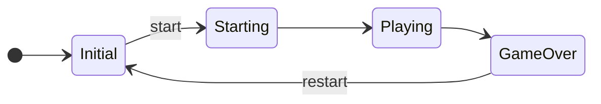

# Bouncing Ball Project

## El juego
El juego consiste en una bola que rebota en los bordes de la pantalla. El jugador debe mover una barra que se encuentra en el borde inferior de la pantalla para que la bola no caiga al suelo. Por cada rebote en la barra, el puntaje se incrementa en un punto, pero aumenta la velocidad de la bola. El juego termina cuando la bola cae al suelo.

## Estados del juego
- `initial`. Se muestra un mensaje de "Bouncing Ball", las reglas del juego, los cinco mejores puntajes y un botón de "Start" para comenzar el juego.
- `starting`. La bola se spawnea en el centro superior de la pantalla y la barra en el centro inferior.
- `playing`. La bola elige una dirección aleatoria y comienza a moverse a 45 grados. Al chocar contra los bordes izquierdo, derecho y superior de la pantalla, rebota en la dirección contraria. Al chocar con la barra, rebota en la dirección contraria y se incrementa la velocidad. Al caer al suelo, el juego termina.
- `game_over`. La bola cae al suelo y el juego termina. Se muestra un mensaje de "Juego Terminado", el puntaje obtenido y un botón de "Restart" para volver a jugar.

## Diagrama de estados

## Configuración del proyecto
- Prefix: `bba`
- Screen Size: 800x450
- Aspect Ratio: 16:9

## Diseño de Prefabs
### `BouncingBallRootPrefab`
Es el GameObject raíz del juego y manejador de los estados globales del juego. La siguiente tabla muestra para cada estado del juego, el componente su componente de estado.

> Nota: Recuerde que sólo un componente de estado estará `enabled` a la vez.

| Estado | Componentes de estado |
|--------|---------------------|
| initial | InitialStateComponent |
| starting | StartingStateComponent |
| playing | PlayingStateComponent |
| game_over | GameOverStateComponent |

### `InitialPrefab`
Pantalla inicial del juego.
    - `title:Label`
        - text: "Bouncing Ball"
        - style: Title
    - `rules:Label`
        - text: "Rules: Move the bar to prevent the ball from falling. Each bounce increases the speed of the ball."
        - style: Body
    - `scores:Table`
        - columns: 2
        - rows: 5
        - headers: "Rank", "Score"
    - `start:Button`
        - text: "Start"
        - onClick: start
