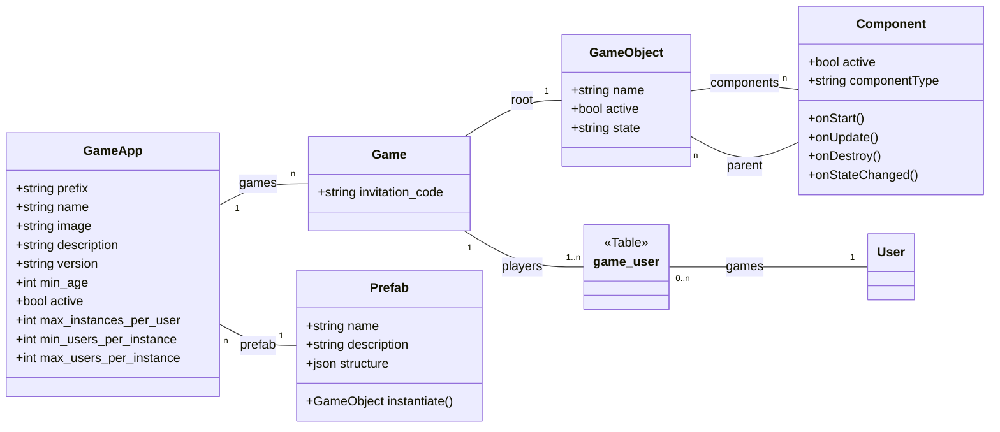

### Diagrama de clases

```mermaid
classDiagram
    direction LR
    class User {
    }
    class GameApp {
        +string prefix
        +string name
        +string image
        +string description
        +string version
        +int min_age
        +bool active
        +int max_instances_per_user
        +int min_users_per_instance
        +int max_users_per_instance
    }
    class Game {
        +string invitation_code
    }
    class game_user {
        <<Table>>
    }
    class Prefab {
        +string name
        +string description
        +json structure
        +GameObject instantiate()
    }
    class GameObject {
        +string name
        +bool active
        +string state
    }
    class Component {
        +bool active
        +string componentType
        +onStart()
        +onUpdate()
        +onDestroy()
        +onStateChanged()
    }
    Game -- "1" GameObject : root
    GameObject -- "n" Component : components
    Component -- "n" GameObject : parent
    GameApp "1" -- "n" Game : games
    Game "1" -- "1..n" game_user : players
    GameApp "n" -- "1" Prefab : prefab
    game_user "0..n" -- "1" User : games
```

