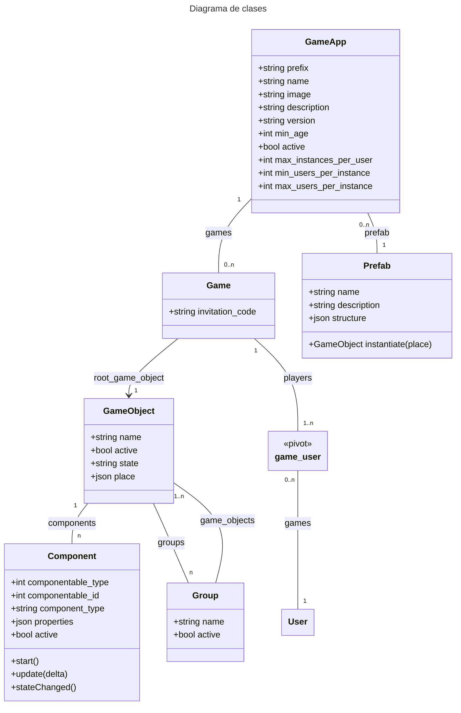
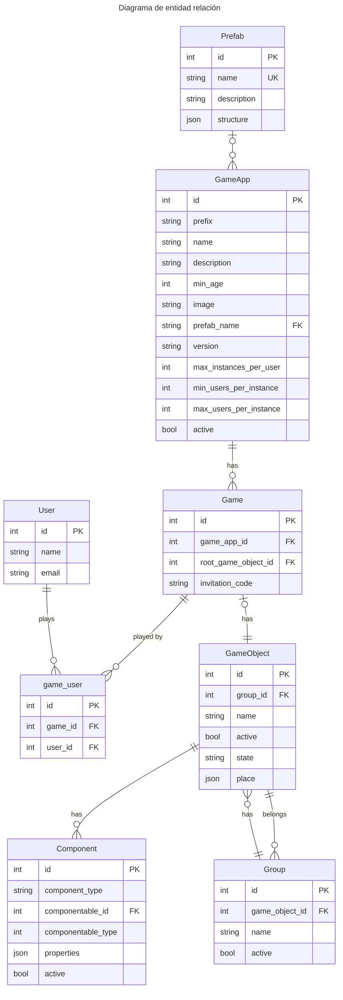

```mermaid
---
title: Diagrama de clases
config:
    class:
      hideEmptyMembersBox: true
---
classDiagram
    direction TD
    class User {
    }
    class GameApp {
        +string prefix
        +string name
        +string image
        +string description
        +string version
        +int min_age
        +bool active
        +int max_instances_per_user
        +int min_users_per_instance
        +int max_users_per_instance
    }
    class Game {
        +string invitation_code
    }
    class game_user {
        <<pivot>>
    }
    class Prefab {
        +string name
        +string description
        +json structure
        +GameObject instantiate(place)
    }
    class GameObject {
        +string name
        +bool active
        +string state
        +json place
    }
    class Group {
        +string name
        +bool active
    }
    class Component {
        +int componentable_type
        +int componentable_id
        +string component_type
        +json properties
        +bool active
        +start()
        +update(delta)
        +stateChanged()
    }
    Game --> "1" GameObject : root_game_object
    GameObject "1" -- "n" Component : components
    GameObject -- "n" Group : groups
    Group -- "1..n" GameObject : game_objects
    GameApp "1" -- "0..n" Game : games
    Game "1" -- "1..n" game_user : players
    GameApp "0..n" -- "1" Prefab : prefab
    game_user "0..n" -- "1" User : games
```

```mermaid
---
title: Diagrama de entidad relación
---
erDiagram
    GameApp ||--o{ Game : "has"
    Game ||--o{ game_user : "played by"
    GameObject ||--o{ Component : "has"
    GameObject ||--o{ Group : "belongs"
    Group ||--o{ GameObject : "has"
    Prefab one or zero --o{ GameApp : ""
    User ||--o{ game_user : "plays"
    Game one or zero -- 1 GameObject : "has"

    GameApp {
        int id PK
        string prefix
        string name
        string description
        int min_age
        string image
        string prefab_name FK
        string version
        int max_instances_per_user
        int min_users_per_instance
        int max_users_per_instance
        bool active
    }

    Game {
        int id PK
        int game_app_id FK
        int root_game_object_id FK
        string invitation_code
    }

    game_user {
        int id PK
        int game_id FK
        int user_id FK
    }

    Prefab {
        int id PK
        string name UK
        string description
        json structure
    }

    GameObject {
        int id PK
        int group_id FK
        string name
        bool active
        string state
        json place
    }

    Group {
        int id PK
        int game_object_id FK
        string name
        bool active
    }

    Component {
        int id PK
        string component_type
        int componentable_id FK
        int componentable_type
        json properties
        bool active
    }

    User {
        int id PK
        string name
        string email
    }
```

