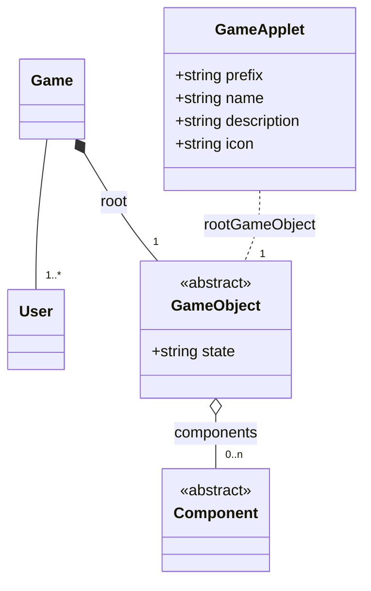

# Diagramas de clase de la aplicación
El siguiente diagrama muestra la relación entre las clases GameApplet, GameObject, Component y User.

```mermaid
classDiagram
    class User {
    }
    class GameApplet {
        +string prefix
        +string name
        +string description
        +string icon
    }
    class Game {
    }
    class GameObject {
        <<abstract>>
        +string state
    }
    class Component {
        <<abstract>>
    }
    GameApplet .. "1" GameObject : rootGameObject
    Game -- "1..*" User
    Game *-- "1" GameObject : root
    GameObject o-- "0..n" Component : components
```

