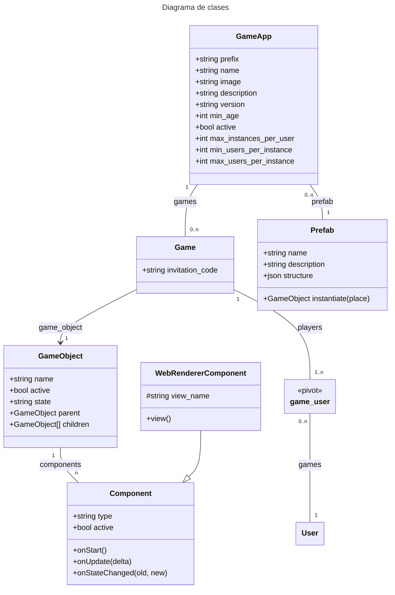
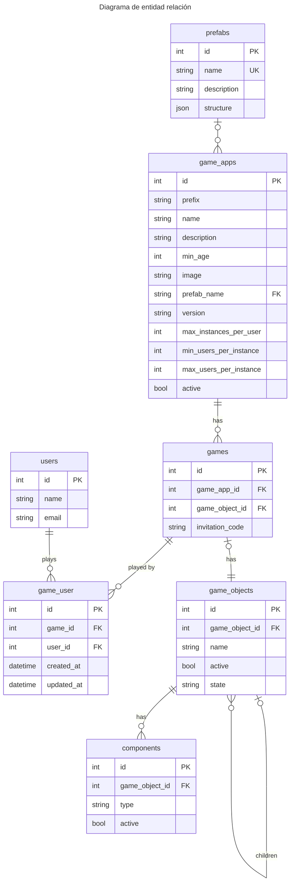

```mermaid
---
title: Diagrama de clases
config:
    class:
        hideEmptyMembersBox: true
---
classDiagram
    direction TD
    class User {
    }
    class GameApp {
        +string prefix
        +string name
        +string image
        +string description
        +string version
        +int min_age
        +bool active
        +int max_instances_per_user
        +int min_users_per_instance
        +int max_users_per_instance
    }
    class Game {
        +string invitation_code
    }
    class game_user {
        <<pivot>>
    }
    class Prefab {
        +string name
        +string description
        +json structure
        +GameObject instantiate(place)
    }
    class GameObject {
        +string name
        +bool active
        +string state
        +GameObject parent
        +GameObject[] children
    }
    class Component {
        +string type
        +bool active
        +onStart()
        +onUpdate(delta)
        +onStateChanged(old, new)
    }
    class WebRendererComponent {
        #string view_name
        +view()
    }
    Game --> "1" GameObject : game_object
    GameObject "1" -- "n" Component : components
    GameApp "1" -- "0..n" Game : games
    Game "1" -- "1..n" game_user : players
    GameApp "0..n" -- "1" Prefab : prefab
    game_user "0..n" -- "1" User : games
    WebRendererComponent --|> Component
```

```mermaid
---
title: Diagrama de entidad relación
---
erDiagram
    game_apps ||--o{ games : "has"
    games ||--o{ game_user : "played by"
    game_objects ||--o{ components : "has"
    game_objects one or zero -- zero or many game_objects : "children"
    prefabs one or zero --o{ game_apps : ""
    users ||--o{ game_user : "plays"
    games one or zero -- 1 game_objects : "has"

    game_apps {
        int id PK
        string prefix
        string name
        string description
        int min_age
        string image
        string prefab_name FK
        string version
        int max_instances_per_user
        int min_users_per_instance
        int max_users_per_instance
        bool active
    }

    games {
        int id PK
        int game_app_id FK
        int game_object_id FK
        string invitation_code
    }

    game_user {
        int id PK
        int game_id FK
        int user_id FK
        datetime created_at
        datetime updated_at
    }

    prefabs {
        int id PK
        string name UK
        string description
        json structure
    }

    game_objects {
        int id PK
        int game_object_id FK
        string name
        bool active
        string state
    }

    components {
        int id PK
        int game_object_id FK
        string type
        bool active
    }

    users {
        int id PK
        string name
        string email
    }
```

