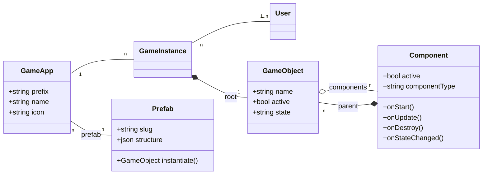

# Diagramas de clases
El siguiente diagrama muestra la relación entre las clases GameApplet, GameObject, Component y User.

```mermaid
classDiagram
    direction LR
    class User {
    }
    class GameApp {
        +string prefix
        +string name
        +string icon
    }
    class GameInstance {
    }
    class Prefab {
        +string slug
        +json structure
        +GameObject instantiate()
    }
    class GameObject {
        +string name
        +bool active
        +string state
    }
    class Component {
        +bool active
        +string componentType
        +onStart()
        +onUpdate()
        +onDestroy()
        +onStateChanged()
    }
    GameInstance *-- "1" GameObject : root
    GameObject o-- "n" Component : components
    Component *-- "n" GameObject : parent
    GameApp "1" -- "n" GameInstance
    GameInstance "n" -- "1..n" User
    GameApp "n" -- "1" Prefab : prefab
```

