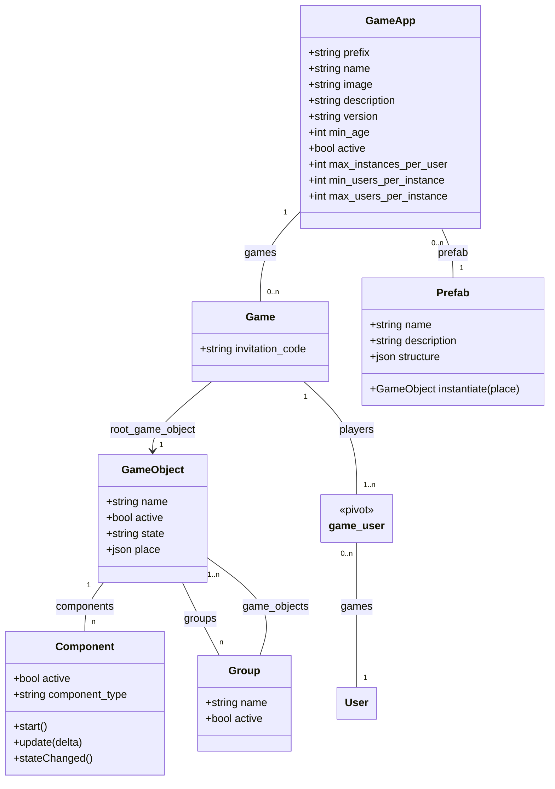

### Diagrama de clases

```mermaid
---
  config:
    class:
      hideEmptyMembersBox: true
---
classDiagram
    direction TD
    class User {
    }
    class GameApp {
        +string prefix
        +string name
        +string image
        +string description
        +string version
        +int min_age
        +bool active
        +int max_instances_per_user
        +int min_users_per_instance
        +int max_users_per_instance
    }
    class Game {
        +string invitation_code
    }
    class game_user {
        <<pivot>>
    }
    class Prefab {
        +string name
        +string description
        +json structure
        +GameObject instantiate(place)
    }
    class GameObject {
        +string name
        +bool active
        +string state
        +json place
    }
    class Group {
        +string name
        +bool active
    }
    class Component {
        +bool active
        +string component_type
        +start()
        +update(delta)
        +stateChanged()
    }
    Game --> "1" GameObject : root_game_object
    GameObject "1" -- "n" Component : components
    GameObject -- "n" Group : groups
    Group -- "1..n" GameObject : game_objects
    GameApp "1" -- "0..n" Game : games
    Game "1" -- "1..n" game_user : players
    GameApp "0..n" -- "1" Prefab : prefab
    game_user "0..n" -- "1" User : games
```

