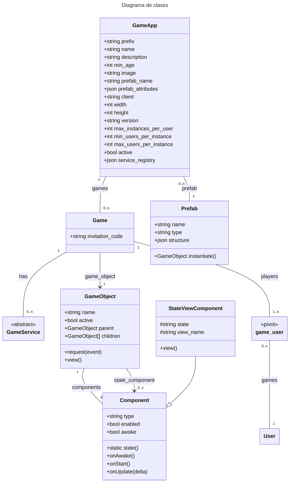
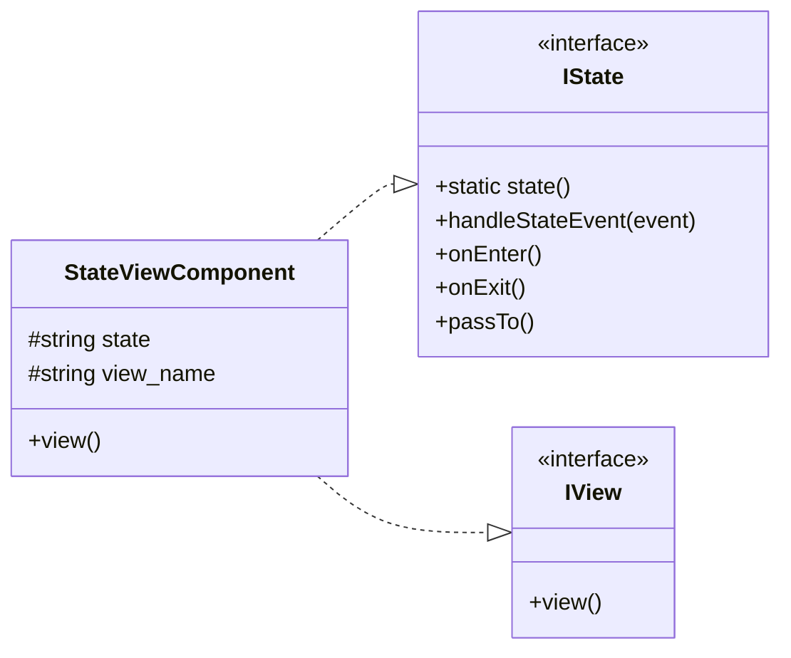
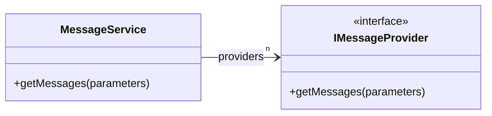
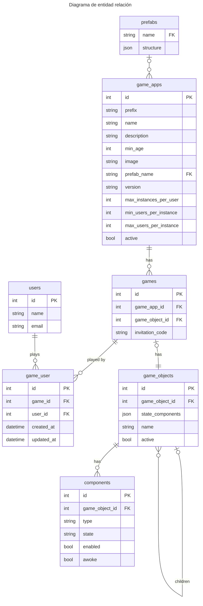

### Estructura de las aplicaciones de juego en el proyecto
Las aplicaciones de juego en el proyecto se estructuran de la siguiente manera:

```ascii
GameApps
├── Common
│   ├── Components
│   │   └── Component_1, ..., Component_n
│   ├── Prefabs
│   │   └── prefabs...
├── prefix1
│   ├── config.php
│   ├── Components
│   │   ├── Component1.php
│   │   └── Component2.php
│   ├── Prefabs
│   │   ├── prefab1.php
│   │   └── prefab2.php
│   ├── Resources
│   │   ├── image1.png
│   │   ├── sound1.ogg
│   │   └── video1.mp4
│   └── Services
│       ├── Service1.php
│       └── Service2.php
└── prefix2
    ├── config.php
    ├── Components
    ├── Prefabs
    ├── Resources
    └── Services
```
En donde cada `prefix` es un identificador único de la aplicación de juego. Cada aplicación de juego tiene su propio directorio, y dentro de este directorio se encuentran los archivos y directorios que la definen. Cada aplicación de juego debe tener un archivo `config.php` que define las características globales de la aplicación de juego.

### GameApp (Aplicación de juego)
Un GameApp define las características globales de un videojuego:
- Se define en un archivo `config.php` en el directorio de la aplicación de juego.
- El nombre del videojuego.
- La versión del videojuego.
- Una descripción del videojuego.
- La resolución de la pantalla.
- Una imagen de fondo.
- La cantidad máxima de partidas que un usuario puede jugar del videojuego. En caso de que se supere esta cantidad, se eliminará la partida más antigua.
- La cantidad mínima y máxima de jugadores que pueden participar en una partida.
- El nombre del prefab raíz del videojuego.
- Un registro de los servicios de juego que se utilizan. Cada servicio de juego se instanciará para cada partida, y pueden ser definidos con o sin persistencia.
Por ejemplo:
```php
<?php
return [
    'image' => 'bouncing-ball.jpeg',
    'name' => 'Bouncing Ball Arena',
    'active' => true,
    'description' => 'Players must bounce a ball into a goal.',
    'width' => 800,
    'height' => 450,
    'max_instances_per_user' => 5,
    'min_players' => 1,
    'max_players' => 4,
    'prefab_name' => 'bba.root',
];
```

### Prefab
Un Prefab es una plantilla que, al ser instanciada, instancia un GameObject con componentes preconfigurados. A su vez, un Prefab puede tener como hijos a otros Prefabs, lo cual permite jerarquías complejas de GameObjects, cuando el Prefab padre es instanciado.

### Game
Un Game continene la información de una partida de uno o más jugadores de un videojuego.
- Una referencia al GameApp al que pertenece.
- Una referencia al GameObject raíz de la partida. Que es una instancia del prefab raíz del videojuego.
- Una lista de jugadores que participan en la partida.
- Un registro de los servicios de juego que se utilizan. Cada servicio de juego se instanciará para cada partida, y pueden ser definidos con o sin persistencia.

### GameObject
Los GameObjects son los objetos principales del juego. Representan a los objetos con los que el jugador interactúa. Pueden ser desde un sprite, una caja de texto, o un contenedor de elementos de UI.

Todo GameObject tiene un estado, que es la información que define su comportamiento y apariencia. Este estado puede ser modificado por los componentes adjuntos al GameObject.

Todo GameObject debe tener al menos un componente que define su comportamiento. Los GameObjects también pueden tener a otros GameObjects como hijos. Esto permite jerarquías complejas de GameObjects.

### Component
Los Componentes son los elementos que definen el comportamiento de un GameObject. Pueden ser desde un componente que define la física de un objeto, hasta un componente que define la lógica de un enemigo.




#### Diagrama de StateViewComponent


#### Sistema de mensajes
El sistema de mensajes consta de un servicio que busca en tiempo de ejecución un proveedor de mensajes para la clase actual.




