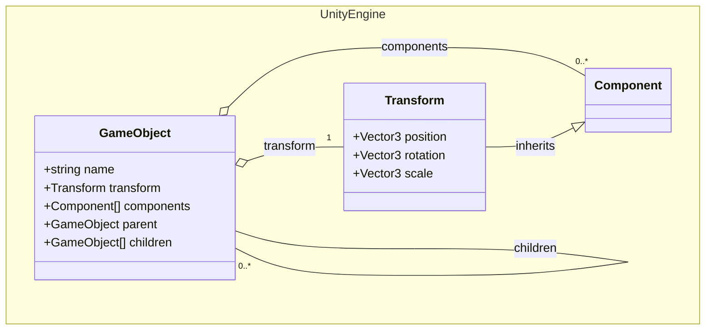
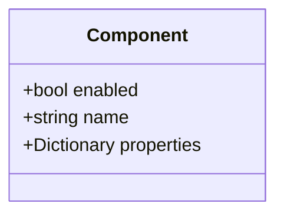
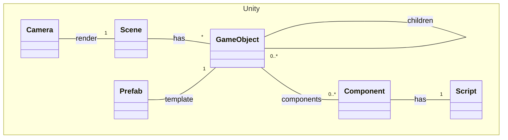
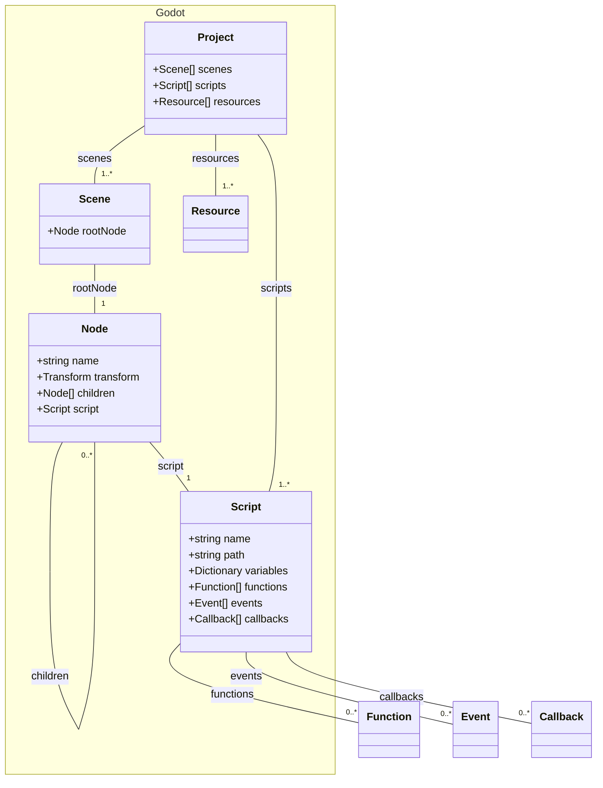

# Arquitectura de Motores de Juegos

## Contenido
1. [Introducción](#introducción)
2. [Unity](#unity)
    1. [GameObject](#gameobject)
    2. [Component](#component)
    3. [Scene y Cámara](#scene-y-cámara)
    4. [Prefab](#prefab)
    5. [Script](#script)
    6. [Relaciones](#relaciones)
3. [Godot](#godot)
    1. [Node](#node)
    2. [Scene](#scene)
    3. [Scripts](#scripts)
    4. [Recursos](#recursos)
    5. [Proyecto](#proyecto)
    6. [Relaciones entre los elementos](#relaciones-entre-los-elementos)
4. [Comparación](#comparación)
5. [Conclusión](#conclusión)

## Introducción
Este documento presenta una descripción detallada de la arquitectura de componentes de dos motores de videojuegos: Unity y Godot, desde la perspectiva de un programador. Se analizan los componentes principales de cada motor y sus interrelaciones. Además, se comparan las similitudes y diferencias entre ambos motores.

## Unity
### GameObject
Los GameObjects son los bloques de construcción fundamentales en Unity. Un GameObject es un contenedor que puede albergar múltiples componentes, como scripts, cámaras, luces y otros elementos. Los GameObjects pueden ser instanciados en la escena y manipulados en tiempo de ejecución. Además, permiten la creación de jerarquías mediante relaciones padre-hijo, lo que facilita la organización y manipulación de los elementos de la escena.
Entre los atributos más comunes de un GameObject se encuentran:
- **Nombre**: Identifica el GameObject.
- **Transform**: Controla la posición, rotación y escala del GameObject.
- **Componentes**: Almacenan la lógica y funcionalidades del GameObject.
- **Relaciones**: Establecen la jerarquía entre los GameObjects.
El siguiente diagrama muestra la estructura de un GameObject en Unity:



El siguiente código muestra cómo se puede crear un GameObject en Unity:

```csharp
using UnityEngine;

public class MyScript : MonoBehaviour
{
    void Start()
    {
        // Crear un nuevo GameObject
        GameObject cube = new GameObject("Cube");
        // Añadir un componente al GameObject para renderizarlo
        cube.AddComponent<MeshRenderer>();
    }
}
```

En este ejemplo, se define un componente llamado `MyScript`, el cual en su método `Start()` (al iniciarse) crea un nuevo GameObject llamado "Cube" al que le añade un componente de renderizado de malla (`MeshRenderer`) para que sea visible en la escena.

En resumen, los GameObjects:
- Son contenedores que pueden albergar múltiples componentes.
- Pueden ser instanciados en la escena y manipulados en tiempo de ejecución.
- Permiten la creación de jerarquías mediante relaciones padre-hijo.

### Component
Los componentes son módulos que pueden ser adjuntados a los GameObjects para agregar funcionalidades específicas. Los componentes constituyen los bloques de construcción de los GameObjects en Unity y permiten personalizar y extender su comportamiento. Algunos ejemplos de componentes comunes incluyen: scripts, cámaras, luces, colisionadores y efectos de partículas.
Los componentes pueden ser reutilizados en diferentes GameObjects para facilitar el desarrollo y la gestión de la escena.

Entre los componentes más comunes en Unity se encuentran:
- **Transform**: Controla la posición, rotación y escala de un GameObject.
- **MeshRenderer**: Renderiza la malla de un objeto en la escena.
- **Collider**: Detecta colisiones entre objetos.
- **Rigidbody**: Aplica físicas a un objeto.
- **Script**: Permite añadir lógica y comportamiento a un GameObject mediante código.

Los atributos más comunes de un componente son:
- **Nombre**: Identifica el componente.
- **Active**: Indica si el componente está activo o inactivo.
- **Propiedades**: Almacenan información específica del componente.

El siguiente diagrama muestra la estructura de un Component en Unity:



### Scene y Cámara
Una Scene (escena) en Unity representa un nivel o pantalla del juego. Contienen GameObjects y otros elementos como: cámaras, luces y efectos visuales. Para que un GameObject sea visible, debe formar parte de una Scene que tenga una cámara para renderizarla.
En general, constituyen contenedores que permiten organizar y gestionar los diferentes niveles y secciones del juego de forma independiente.

Por otro lado, una Cámara es un componente que renderiza la escena en la pantalla. Las cámaras pueden configurarse para mostrar diferentes vistas de la escena, como perspectivas, zooms y efectos visuales. Son esenciales para la visualización y presentación de la escena al jugador.

### Prefab
- Un Prefab es una plantilla de GameObject reutilizable en múltiples escenas.
- Permiten crear GameObjects con configuraciones específicas y reutilizarlos en diferentes partes del juego.

### Script
- Un Script es un archivo de código que puede ser adjuntado a un GameObject como un componente.
- Los scripts, escritos en C# o JavaScript, controlan el comportamiento de los GameObjects en el juego.

### Relaciones
- Los GameObjects contienen componentes.
- Los componentes pueden estar asociados a scripts.
- Los scripts controlan el comportamiento de los GameObjects en la escena.
- Las Scenes contienen GameObjects y otros objetos de la escena.
- Los Prefabs son plantillas de GameObjects reutilizables en diferentes escenas.

El siguiente diagrama muestra las relaciones entre los componentes principales de Unity:



## Godot
### Node
Los Nodes son los elementos fundamentales en Godot Engine. Un Node es un objeto que puede contener lógica, gráficos, sonido y otros elementos. Los Nodes pueden ser instanciados en la escena y organizados en una jerarquía de nodos. Cada Node tiene un tipo específico que define su comportamiento y funcionalidades.
Entre los atributos más comunes de un Node se encuentran:
- **Nombre**: Identifica el Node.
- **Transform**: Controla la posición, rotación y escala del Node.
- **Children**: Almacena los nodos hijos del Node.
- **Script**: Contiene la lógica y comportamiento del Node.

### Scene
En Godot, una Scene se define a partir de un único Node raíz de un árbol de nodos.
Para que una Scene sea visible, debe contener al menos un Node con un componente de renderizado, como un Sprite, un Control o un MeshInstance.

### Scripts
Los Scripts en Godot son archivos de código que contienen la lógica y el comportamiento de los Nodes en la escena. Un Script puede ser adjuntado a un Node para controlar su comportamiento y reaccionar a eventos del juego.

Entre los atributos más comunes de un Script se encuentran:
- **Nombre**: Identifica el Script.
- **Path**: Ruta del archivo de código.
- **Variables**: Almacenan información específica del Script.
- **Funciones**: Contienen la lógica y comportamiento del Script.
- **Eventos**: Se ejecutan en respuesta a acciones específicas.
- **Callbacks**: Son métodos predefinidos que se ejecutan en momentos específicos.

Los principales callbacks de un Script en Godot son:
- **_ready()**: Se ejecuta cuando el Node está listo.
- **_process()**: Se ejecuta en cada frame.
- **_input()**: Se ejecuta al recibir eventos de entrada.
- **_physics_process()**: Se ejecuta en cada frame de físicas.

### Recursos
Los Recursos en Godot son archivos que contienen datos, como texturas, sonidos, scripts y escenas. Los Recursos pueden ser reutilizados en diferentes partes del juego y permiten una gestión eficiente de los elementos del juego.

### Proyect
Un Proyect en Godot es un conjunto de Scenes, Scripts y recursos que conforman un juego o una aplicación. Los Proyects permiten organizar y gestionar los elementos del juego de forma estructurada y coherente.

### Relaciones entre los elementos
El siguiente diagrama muestra las relaciones entre los elementos principales de Godot:



## Comparación
A continuación, se presentan las similitudes y diferencias entre la arquitectura de componentes de Unity y Godot:

### Estructura de Datos

**Unity**:
- Unity utiliza una estructura de datos basada en GameObjects.
- Cada GameObject puede contener múltiples Componentes que le agregan funcionalidad.
- Los Componentes están desacoplados entre sí y se pueden agregar, eliminar o modificar de forma independiente.
- Las Escenas de Unity contienen múltiples GameObjects organizados jerárquicamente.
- Las Escenas requieren de una Cámara para poder ser renderizadas.

**Godot**:
- Godot usa una estructura de datos basada en Nodos organizados jerárquicamente en un Árbol de Escena.
- Cada Nodo puede tener Propiedades y Scripts asociados.
- Los Nodos pueden ser de diferentes tipos (Sprites, Áreas, Cámaras, etc.) y se pueden combinar para crear Escenas complejas.
- A diferencia de Unity, en Godot cualquier Nodo que sea visible puede ser renderizado sin necesidad de una Cámara.

### Patrones de Diseño

**Unity**:
- Unity promueve el uso del patrón de diseño Componentes, donde la lógica se divide en Componentes independientes y reutilizables.
- La comunicación entre Componentes se realiza a través de Mensajes, Eventos y Interfaces.
- Unity también utiliza el patrón Observador para implementar la comunicación entre Componentes.

**Godot**:
- Godot sigue un paradigma orientado a Nodos, donde la lógica se organiza en Scripts asociados a cada Nodo.
- La comunicación entre Nodos se realiza a través de Señales (Signals), que permiten implementar patrones como Observador y Mediador.
- Godot también permite el uso de Grupos de Nodos, lo que facilita la organización y comunicación entre elementos de la escena.

### Arquitectura

**Unity**:
- Unity tiene una arquitectura monolítica, donde todo el motor de juego se ejecuta en un solo proceso.
- La renderización, física, audio y otros subsistemas están fuertemente acoplados dentro del motor.
- Unity proporciona herramientas y utilidades integradas para facilitar el desarrollo, como el Editor, Asset Store, etc.

**Godot**:
- Godot tiene una arquitectura más modular, donde los diferentes subsistemas (renderizado, física, audio, etc.) están más desacoplados.
- Godot permite la extensión y personalización del motor a través de módulos y plugins, lo que facilita la integración con tecnologías externas.
- El motor de Godot está escrito en C++ y C#, lo que permite una mayor flexibilidad y rendimiento en comparación con su contraparte scripting.

### Conclusión
En resumen, tanto Unity como Godot son motores de videojuegos poderosos y ampliamente utilizados, pero presentan diferencias significativas en su estructura de datos, patrones de diseño y arquitectura interna. Mientras que Unity se enfoca en un enfoque basado en Componentes y una arquitectura más monolítica, Godot adopta un paradigma orientado a Nodos y una estructura más modular. Estas diferencias se traducen en ventajas y desventajas que los desarrolladores deben considerar al elegir la plataforma más adecuada para sus proyectos.