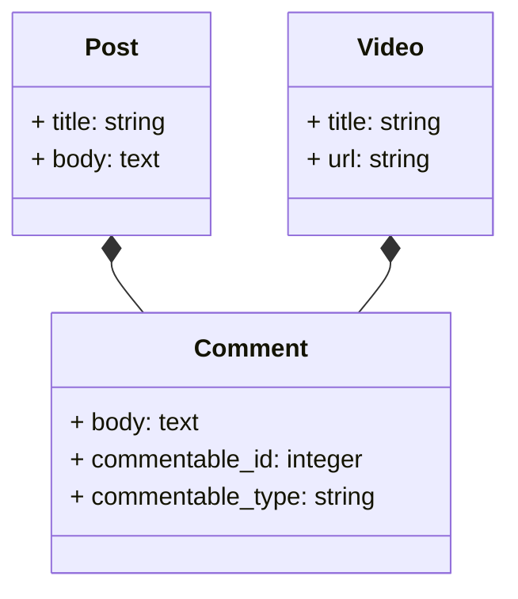

# Relaciones Polimórficas en Laravel
## Contenido
- [¿Qué son las Relaciones Polimórficas?](#qué-son-las-relaciones-polimórficas)
- [Tipos de Relaciones Polimórficas](#tipos-de-relaciones-polimórficas)
- [Relación Polimórfica (Uno a Muchos)](#relación-polimórfica-uno-a-muchos)
  - [1. Crear Modelos](#1-crear-modelos)
  - [2. Definir Migraciones](#2-definir-migraciones)
  - [3. Definir Modelos](#3-definir-modelos)
  - [4. Ejemplo de Uso](#4-ejemplo-de-uso)

## ¿Qué son las Relaciones Polimórficas?
En el ORM Eloquent de Laravel, una relación polimórfica permite que un modelo pertenezca a más de un modelo en una sola asociación. Esto es útil cuando deseas compartir una relación entre varios modelos sin duplicar la lógica de la relación.

## Tipos de Relaciones Polimórficas
Laravel admite dos tipos de relaciones polimórficas:
- **Uno a Uno (One-to-One)**: Un modelo puede pertenecer a otro modelo.
- **Uno a Muchos (One-to-Many)**: Un modelo puede tener múltiples modelos relacionados.

## Relación Polimórfica (Uno a Muchos)
Supongamos que tenemos dos modelos, `Post` y `Video`, que pueden recibir comentarios. En lugar de crear dos tablas de `comments` separadas, podemos usar una relación polimórfica para gestionar los comentarios de ambos modelos.

### 1. Crear Modelos
Crearás tres modelos:
- **Post**
- **Video**
- **Comment (Comentario)**
Un `Comment` puede pertenecer a un `Post` o a un `Video`.



Ejecuta los siguientes comandos para crear los modelos y sus migraciones:

```bash
php artisan make:model Post -m
php artisan make:model Video -m
php artisan make:model Comment -m
```

### 2. Definir Migraciones

**Migración de la tabla `posts`**:
```php
public function up() {
    Schema::create('posts', function (Blueprint $table) {
        $table->id();
        $table->string('title');
        $table->text('body');
    });
}
```

**Migración de la tabla `videos`**:
```php
public function up() {
    Schema::create('videos', function (Blueprint $table) {
        $table->id();
        $table->string('title');
        $table->string('url');
    });
}
```

**Migración de la tabla `comments`** (Relación polimórfica con método `morphs`):
```php
public function up() {
    Schema::create('comments', function (Blueprint $table) {
        $table->id();
        $table->text('body');
        $table->morphs('commentable'); // Crea 'commentable_id' y 'commentable_type'
        $table->timestamps();
    });
}
```

La función `morphs('commentable')` crea dos columnas:
- `commentable_id` (el ID del modelo que está siendo comentado).
- `commentable_type` (el tipo del modelo, ya sea `Post` o `Video`).

### 3. Definir Modelos

**Modelo Post (`Post.php`)**:
```php
class Post extends Model {
    public function comments()
    {
        return $this->morphMany(Comment::class, 'commentable');
    }
}
```

**Modelo Video (`Video.php`)**:
```php
class Video extends Model {
    public function comments()
    {
        return $this->morphMany(Comment::class, 'commentable');
    }
}
```

**Modelo Comment (`Comment.php`)**:
```php
class Comment extends Model {
    public function commentable()
    {
        return $this->morphTo();
    }
}
```

### 4. Ejemplo de Uso
Ahora puedes asociar comentarios con publicaciones o videos:

```php
// Crear un post
$post = Post::create(['title' => 'Primer posteo', 'body' => 'Posteo de ejemplo']);

// Crear un video
$video = Video::create(['title' => 'Primer video', 'url' => 'http://example.com/video']);

// Agregar comentarios al post
$post->comments()->create(['body' => 'Great post!']);
$post->comments()->create(['body' => 'Nice article!']);

// Agregar comentarios al video
$video->comments()->create(['body' => 'Great video!']);
$video->comments()->create(['body' => 'I loved this content!']);

// Obtener comentarios de un post o video
$postComments = $post->comments;
$videoComments = $video->comments;
```

En este ejemplo, tanto `Post` como `Video` pueden tener comentarios, pero comparten la tabla `comments`, lo que permite una estructura flexible que se puede extender a otros modelos si es necesario.

## Conclusión
Las relaciones polimórficas en Laravel son útiles cuando deseas compartir una relación entre varios modelos.
